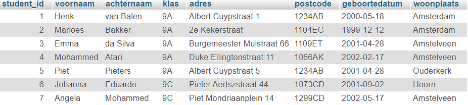

# MYSQL-ADVANCED-INSERT INTO-TAAK-01

## Gegevens toevoegen in de database


## Uitleg

Zoals je met een `SELECT` statement gegevens uit een database kunt halen, kun je met `INSERT INTO` gegevens invoeren. Het toevoegen van gegevens gaat per rij / record en één voor één. Je gebruikt hiervoor dan ook geen condities (`WHERE`).


## Syntax

De Syntax voor het schrijven van een INSERT INTO statement is als volgt:
```SQL
INSERT INTO tabel_naam (kolom1, kolom2, kolom3, ...)
VALUES (waarde1, waarde2, waarde3, ...);
```

Bijvoorbeeld: We hebben een tabel `games` met de kolommen `id`, `game_titel` en `platform` (zie afbeelding)


Nu wil je een nieuwe titel toevoegen, namelijk `Zelda` voor het platform `Switch`. Deze game krijgt `id` = 15

De SQL-query ziet er dan alsvolt uit:

```SQL
INSERT INTO games (id, game_titel, platform)
VALUES (15, 'Zelda', 'Switch');
```
Als we dit in taal zouden uitspreken, zou je zeggen: Voeg toe aan de tabel `games` een nieuw record met het id = 15, de titel 'Zelda' en het platform 'Switch'

> Let hierbij op het type data. Een getal wordt zonder- en een string wordt mét aanhalingstekens gebruikt.

> Let goed op dat je de volgorde van de kolommen dezelfde maakt als die van de waardes!

## Leerdoelen

1. Ik kan een SQL statement schrijven waarmee ik een nieuw record kan toevoegen aan een tabel

## Opdracht

1. We gebruiken een nieuwe database export genaamd `studenten.sql`. Deze vind je in de `db-export` map.
2. Om te beginnen open je PhpMyAdmin in je browser, maak een nieuwe database aan (noem deze `mod-mysql-advanced-studenten`) en importeer het `.sql` bestand. Vergeet niet de database eerst te selecteren voor je de import doet.
3. Deze database bevat een tabel genaamd `studenten` met de volgende kolommen: `student_id`, `voornaam`, `achternaam` , `klas`, `adres`, `postcode`, `geboortedatum` en `woonplaats`. De tabel ziet er ongeveer zo uit:
   student_id | voornaam | achternaam | klas | adres | postcode | geboortedatum | woonplaats
   --------| -------| -----| ------| --------| -------| -----| ------|
    3 | Emma | da Silva | 9A | Albert Cuypstraat 3 | 1234AB | 2001-04-28 | Amstelveen |
    4 | Mohammed | Atari | 9C | Kalverstraat 1 | 1678DC | 2003-01-17 | Amstelveen |
   ... | ... | ... | ...| ... | ... | ... | ...|


4. Open het SQL tabblad in PhpMyAdmin en schrijf SQL queries om zes nieuwe studenten in te voeren in de database. Je hoeft hiervoor niet de echte gegevens van medestudenten te gebruiken. De studentgegevens verzinnen mag ook.

> Let er op dat je de geboorte datum het volgende formaat geeft: `jjjj-mm-dd`. Dus 25 maart 2002 wordt `2002-03-25`

   >**(vergeet niet voor elke ingevoerde student het SQL statement dat je geschreven hebt te copy/pasten in `antwoorden.sql`. Maak voor twee van de invoeren een bookmark met als naam de voornaam van de student)**


## Eindresultaat

Onderstaand plaatje geeft gedeeltelijk aan wat je zou moeten terugkrijgen als je de voorbeeld opdrachten hebt uitgevoerd.

<!--  -->




## Bronnen


[W3 Schools - SQL INSERT INTO Statement](https://www.w3schools.com/sql/sql_insert.asp) 