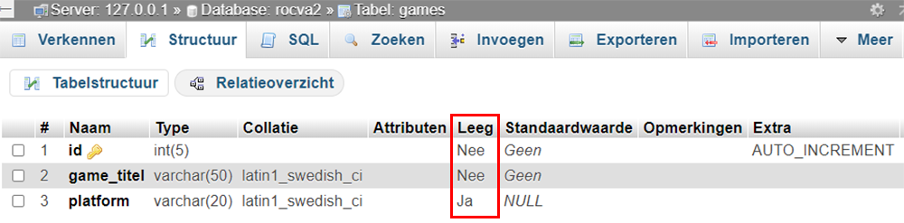

# MYSQL-ADVANCED-INSERT INTO-TAAK-02

## Gegevens toevoegen in de database | vervolg


## Uitleg

Als een tabel veel kolommen heeft kan een INSERT INTO query erg lang worden. Vaak is het niet nodig of mogelijk om alle kolommen op te nemen in de query. Het kan bijvoorbeeld zijn dat je (nog) niet alle gegevens van een record hebt.

Ook kunnen velden niet worden opgenomen, omdat ze `auto increment` zijn. Vaak is dat het geval met de primaire sleutel van een tabel. In onderstaande afbeelding is dat `id`.

>Wat is `auto increment` ook al weer? Auto increment wil zeggen dat de waarde automatisch wordt aangemaakt bij het toevoegen van een nieuw record.


## Nogmaals de basisSyntax

De Syntax voor het schrijven van een INSERT INTO statement is als volgt:
```SQL
INSERT INTO tabel_naam (kolom1, kolom2, kolom3, ...)
VALUES (waarde1, waarde2, waarde3, ...);
```

Bijvoorbeeld: We hebben een tabel `games` met de kolommen `id`, `game_titel` en `platform` (zie afbeelding)


De SQL-query ziet er dan alsvolt uit:

```SQL
INSERT INTO games (id, game_titel, platform)
VALUES (15, 'Zelda', 'Switch');
```

Bij deze tabel is `id` de primaire sleutel en is auto-increment. 

Omdat het veld `id` auto-increment is, hoeven we dus geen id mee te geven in de query. De query kan er dan alvolgt uitzien.

```SQL
INSERT INTO games (game_titel, platform)
VALUES ('Zelda', 'Switch');
```

Bij deze tabel is `game_titel` een verplicht veld en het veld `platform` is optioneel (niet verplicht).

Je kunt dit in phpMyAdmin zien in de tab 'structuur' (of structure). Als de kolom `Leeg` is gevuld me `'Ja'`, dan mag het veld leeg worden gelaten.




Aangezien het veld platform niet verplicht is, kunnen we deze ook weglaten. De volgende query wordt hierdoor ook geaccepteerd door de database:

```SQL
INSERT INTO games (game_titel)
VALUES ('Zelda');
```


## Leerdoelen

1. Ik kan een SQL statement schrijven waarmee ik een nieuw record kan toevoegen aan een tabel
2. Ik weet wat auto increment betekent en hoe ik dit kan toepassen in een SQL-query
3. Ik weet het verschil tussen verplichte- en niet verplichte database velden 

## Opdracht

1. Open het SQL tabblad in PhpMyAdmin en schrijf SQL queries om drie nieuwe studenten in te voeren in de database. Je hoeft hiervoor niet de echte gegevens van medestudenten te gebruiken. De studentgegevens verzinnen mag ook. Het veld `student_id` is auto-increment. Deze neem je niet op in de sql-query!!


2. Zoals je in phpMyAdmin al ziet zijn niet alle velden verplicht in de tabel. Dit is te zien op het tapblad 'structuur' (structure) in de kolom 'leeg'. Als hier 'ja' staat, betekent dit dat deze velden niet verplicht zijn. De kolommen in de tabel 'studenten' die niet verplicht zijn, zijn:
`klas`, `adres` en `postcode`
Voeg nog 3 studenten toe zonder de verplichte velden.

   >**(vergeet niet voor elke ingevoerde student het SQL statement dat je geschreven hebt te copy/pasten in `antwoorden.sql`. Maak voor twee van de invoeren een bookmark met als naam de voornaam van de student)**


## Eindresultaat

Onderstaand plaatje geeft gedeeltelijk aan wat je zou moeten terugkrijgen als je de voorbeeld opdrachten hebt uitgevoerd.

<!--  -->


## Bronnen


[W3 Schools - SQL INSERT INTO Statement](https://www.w3schools.com/sql/sql_insert.asp) 