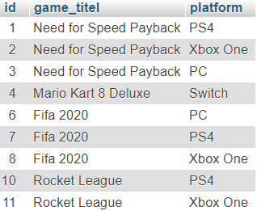
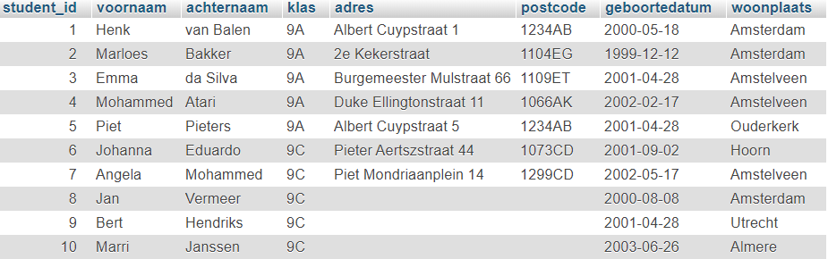

# MYSQL-ADVANCED-UPDATE-TAAK-01

## Gegevens veranderen in de database


## Uitleg

Zoals je met een `SELECT` statement gegevens uit een database kunt halen, je met `INSERT INTO` gegegvens kunt invoeren, kun je met het statement `UPDATE` gegevens in een tabel veranderen. Je kunt dit doen voor één enkel record (rij), voor een aantal rijen, of voor alle rijen in de tabel.


## Syntax

De Syntax voor het schrijven van een `UPDATE` statement is als volgt:
```SQL
UPDATE tabelnaam
SET kolom1 = waarde1, kolom2 = waarde2, etc.
WHERE conditie;
```

Bijvoorbeeld: We hebben een tabel `games` met de kolommen `id`, `game_titel` en `platform` (zie afbeelding)




Nu wil je dat de game met `id` = 6 (Fifa 2020) het `platform` 'Switch' krijgt, in plaats van het huidige 'PC'.

De SQL-query ziet er dan alsvolt uit:

```SQL
UPDATE games
SET platform = 'Switch'
WHERE id = 6;
```
> Als je geen conditie gebruikt (`WHERE`), worden alle rijen in de tabel aangepast!


## Leerdoelen

1. Ik kan een SQL-statement schrijven waarmee ik velden van een record in een tabel kan veranderen
2. Ik  begrijp wat de functie van een conditie is binnen een UPDATE-statement en wat er gebeurt als deze niet wordt toegevoegd

## Voorbereiding

1. We gebruiken een nieuwe database export genaamd `studenten2.sql`. Deze vind je in de `db-export` map.
2. Om te beginnen open PhpMyAdmin in je browser en selecteer de database `mod-mysql-advanced-studenten` die je in een eerdere taak hebt aangemaakt. Heb je deze database nog niet, maak die dan nu aan. Importeer het `.sql` bestand. Vergeet niet de database eerst te selecteren voor je de import doet.
3.  Deze database bevat een tabel genaamd `studenten2` met de volgende kolommen: `student_id`, `voornaam`, `achternaam` , `klas`, `adres`, `postcode`, `geboortedatum` en `woonplaats`. De tabel ziet er alsvolgt uit:



4. Open het SQL tabblad in PhpMyAdmin en schrijf SQL queries om de gevraagde gegevens te tonen:  
> **(vergeet niet na elke beantwoorde vraag de SQL statement die je geschreven hebt te copy/pasten in `antwoorden.sql` en een bookmark met een logisch genaamd label aan te maken)**

## Opdracht

1. Schrijf een SQL-statement die in één keer de woonplaatsen van alle studenten naar 'Amstelveen' verandert.
2. Schrijf SQL-statements voor de drie studenten waarvan de velden `adres` en `postcode` nog leeg zijn. Zorg dat deze velden hiermee worden gevuld.
3. De geboortedatum van Marloes klopt niet. Verander deze met een SQL-statement naar 12 december 2000. Let hierbij op het datum-formaat. Dit moet zijn: `jjjj-mm-dd`
4. Jan en Mohammed wisselen van klas. Pas dit aan met SQL statements.
5. De naam van Johannah is verkeerd ingevoerd. Deze moet met een `h`aan het eind. Pas dit aan met een SQL-statement. 

## Bronnen

[W3 Schools - SQL UPDATE Statement](https://www.w3schools.com/sql/sql_update.asp) 