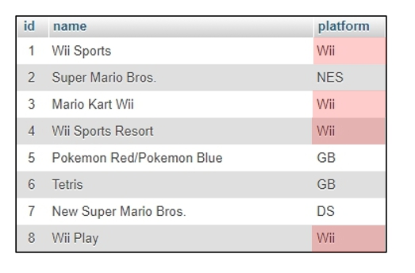
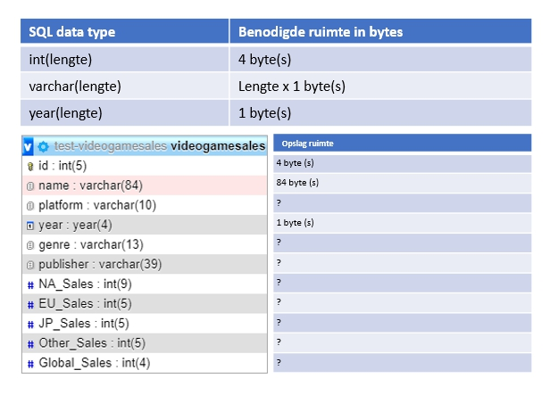

# MYSQL-ADVANCED-RELATIES-TAAK-01

## Dubbele data

## Uitleg

MySQL is een zogenaamd Relationeel Database Systeem. Het Relationeel gedeelte slaat op de relaties die je kunt leggen tussen de verschillende tabellen in een database. Dit is handig omdat je daarmee o.a. vermijd dat je database bestaat uit één grote tabel met veel dubbele data.

Je hebt in de **Mysql-Basic** module gebruik gemaakt van de `videogamesales` database waarin informatie stond over verschillende games. In onderstaand plaatje is een klein deel van die database te zien. 

### Dubbele data

De volledige tabel die we eerder gebruikten bevat 16719 verschillende games die op één van de 31 verschillende platformen zijn uitgebracht. In het bovenstaande plaatje zie je al waartoe dit leidt als je deze informatie in een enkele tabel opslaat: in de `platform` kolom komt vaak dezelfde waarde voor. Je ziet bijvoorbeeld 4 keer de waarde `Wii` terugkomen. Dit gaat in tegen een van de regels van goed database ontwerp: **vermijd dubbele data**.

Er zijn nog meer redenen waarom je de bovenstaande situatie wilt vermijden in je database maar voor nu gaan we kijken (met een ietswat versimpelt voorbeeld) naar hoeveel ruimte een tabel eigenlijk inneemt. 

## Leerdoelen

1. Ik begrijp dat de verschillende datatypes in MySQL een verschillende hoeveelheid opslag ruimte innemen.
2. Ik kan een ruwe inschatting maken van de opslag ruimte die nodig voor gegevens in een database van een bepaald datatype.

## Opdracht

1. In onderstaand plaatje is een overzicht te zien van de `videogamesales` tabel die je in **MySQL-Basic** bij verschillende taken hebt gebruikt. Gebruik de informatie in het plaatje om uit te rekenen hoeveel opslagruimte de tabel inneemt. Zet je antwoord in `antwoord.md` en ga er voor het gemak vanuit dat 1 kb gelijk is aan 1000 bytes.
   > LETOP: de echte tabel bestaat uit 16719 rijen. De totale ruimte die dus door de `id` kolom wordt opgenomen is 4 bytes * 16719 = 66876 bytes = 66,8 kilobytes. De totale ruimte van de tabel is dus de ruimte die alle velden samen innemen keer het aantal rijen in de tabel.

2. Je kunt er vanuit gaan dat de volgende kolommen veel dubbele data bevatten: `platform`, `genre` en `publisher`. Om precies te zijn bevat de `platform` kolom 31 unieke waarden, de `genre` kolom heeft er maar 12 en de `publisher` kolom bevat van deze drie kolommen de meeste unieke waarden met 582. Stel nou dat je alleen de unieke waarden zou opslaan in de database en dus alle dubbele data vermijd. Hoeveel zou dit dan schelen per kolom wat betreft de opslag ruimte die nodig is? Zet je antwoorden in `antwoord.md`.

## Bronnen
