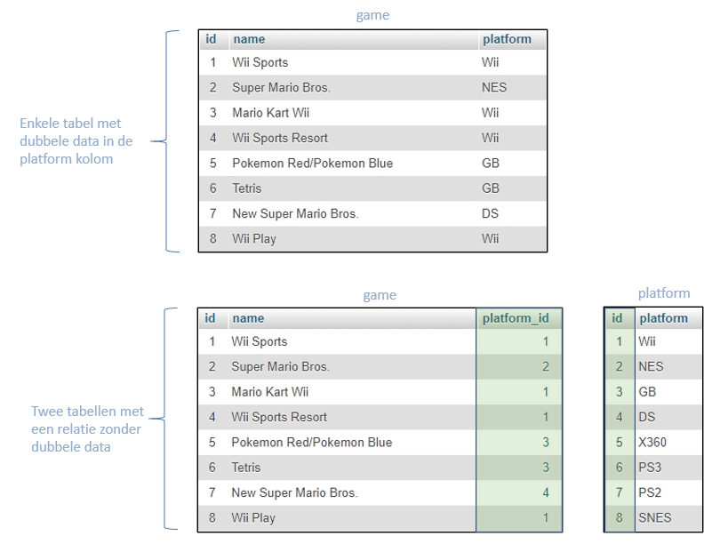

# MYSQL-ADVANCED-RELATIES-TAAK-02

## Relaties tussen database-tabellen

## Uitleg

In de vorige taak hebben we uitgerekend hoeveel het *ongeveer* scheelt als we dubbele data vermijden in onze database. In werkelijkheid is de manier waarop databases gegevens opslaan iets complexer dan dat er bij de vorige taak wordt beschreven en verschilt dit ook per database systeem. Maar hoe kunnen we een database zo ontwerpen dat die geen dubbele data bevat?

### Oplossing dubbele data

Om het probleem van de dubbele data op te lossen ontwerpen we de database met twee tabellen in plaats van één. Hoe dat eruit ziet zie in je in onderstaand plaatje.

 In bovenstaand plaatje zie dat er twee nieuwe kolommen bij zijn gekomen: `platform_id` in de `game` tabel en `id` in de `platform` tabel. Om te zien voor welk platform een bepaalde game is uitgekomen hoef je alleen de waarde in de `platform_id` kolom in de `game` tabel te vergelijken met de waarde in de `id` kolom in de `platform` tabel. Als deze gelijk is dan horen de gegevens in die rijen bij elkaar. 
 
 Met het bovenstaand plaatje als voorbeeld kun je bijvoorbeeld afleiden dat **Wii Sports** is uitgebracht voor het **Wii** platform. En **Super Mario Bros** voor de **NES**. Kijk goed naar het plaatje, kun je afleiden voor welk platform Tetris is uitgebracht? 

 Als je kijkt in de `platform_id` kolom bij de rij van Tetris zie je dat er een 3 staat. Als je dan het getal 3 opzoekt bij de `platform` tabel in de `id` kolom dan kom je uit bij de derde rij en de waarde die dan in de `platform` kolom staat in die rij is **GB**, oftewel Gameboy.

Dit is ook hoe MySQL de gegevens uit meerdere tabellen samenvoegd: door te kijken naar de inhoud van specieke kolommen en die met elkaar te vergelijken. Later gaan kijken hoe je met een SQL statement gegevens kan ophalen en samenvoegen uit meerdere tabellen.

> EXTRA: Wat levert dit dan op qua opslagruimte besparing? Uiteindelijk houden we dus twee tabellen over: de `game` tabel met 16719 rijen en de `platform` tabel met (maar!) 31 rijen. In dit voorbeeld is de ruimtebesparing niet heel groot: je vervangt de `game.platform` kolom die wordt opgeslagen als een varchar(4) door de `game.platform_id` kolom die wordt opgeslagen als een int(2). Voor 16719 rijen scheelt dit 1 byte per rij dus in totaal 16719 rijen = 16,7 kb. Je bent echter nog wel wat ruimte kwijt voor de nieuwe `platform` tabel: 31 rijen * 4 bytes voor de `id` kolom en 31 rijden * 4 bytes voor de `platform` kolom is gelijk aan 248 bytes. Totale besparing in deze (heel ruwe) berekening is dus 16719-248= 16471 bytes = 16,5 kilobytes afgerond. Niet heel veel maar je kunt je voorstellen dat dit bij een grotere database wel degelijk uitmaakt.
 
## Leerdoelen

1. Ik begrijp hoe een database server kan zien welke rijen in verschillende tabellen bij elkaar horen.

## Voorbereiding

1. Importeer de database export in de `db-export` map in een nieuw aangemaakte database genaamd `mod-mysql-advanced-videogames`. Deze database bevat 2 tabellen zoals ook getoond in bovenstaande uitleg. Om het wat makkelijker te maken staan er iets minder dan 1000 records in de `game` tabel.

## Opdracht

Beantwoord onderstaand vragen. Je mag hierbij de PhpMyAdmin interface gebruiken of als je wilt kun je meerdere SQL SELECT querries schrijven om het antwoord uit de twee tabellen te halen. De naam van het spel dat hieronder staat is precies hetzelfde als hoe het in de database staat.

Voor welk platform(en) zijn de onderstaande games uitgebracht?

1. Final Fantasy VII
2. Need for Speed Underground
3. Mario Kart 8
4. Grand Theft Auto IV
5. Medal of Honor: Frontline
6. Call of Duty: Advanced Warfare
7. Microsoft Flight Simulator
8. Link's Crossbow Training
9. Tomb Raider
10. God of War

## Bronnen
