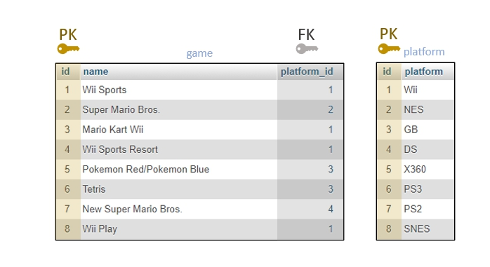

# MYSQL-ADVANCED-RELATIES-TAAK-03

## Relaties tussen database-tabellen

## Uitleg

In de vorige taak hebben we gezien hoe de database server kan zien welke rijen uit verschillende tabellen bij elkaar horen. Dit gebeurt door het vergelijken van de inhoud van 2 kolommen; een in ieder van de twee tabellen die een relatie met elkaar hebben. Maar hoe geef je nu aan in een database welke kolommen met elkaar vergeleken moeten worden?

### Primary Key en Foreign Key

Dit doe je door in elke tabel bepaalde kolommen in te stellen als *sleutel* kolom. Er zijn twee soorten sleutel kolommen: **Primay Key** kolommen en **Foreign Key** kolommen.

#### Primary Key
- **Een Primary Key komt één keer voor per tabel.**
  > Gebruikelijk is om de Primary Key kolom in een tabel `id` te noemen.
- **De waarde van een Primary Key kolom is uniek.**
  > Dit wil zeggen dat er in die kolom niet twee keer hetzelfde getal mag voorkomen.

#### Foreign Key
- **De waarde van een Foreign Key kolom verwijst altijd naar een Primary Key kolom in een andere tabel.**
  > Gebruikelijk is om de naam van de kolom te baseren op de tabel waarnaar de Foreign Key verwijst met als toevoeging "_id" of "-id". Dus de `platform_id` Foreign Key kolom verwijst naar de `platform` tabel.
- **Een tabel kan meerdere Foreign Key kolommen bevatten**
  > Stel dat we onze `videogamesales` voorbeeld database verder uitwerken door naast de `platform` kolom ook de `genre` en `publisher` gegevens in een eigen tabel te zetten dan krijgt de `game` tabel dus in totaal 3 Foreign Key kolommen: `platform_id`, `genre_id` en `publisher_id`.

In onderstaand plaatje staat aangegeven wat de primary en foreign key kolommen zijn in onze versimpelde `videogames` database. 

## Leerdoelen

1. Ik weet wat een Primary Key is en waarom die gebruikt wordt in een database.
2. Ik weet wat een Foreign Key is en waarom die gebruikt wordt in een database.

## Opdracht

1. Lees de tekst bij de uitleg goed. In volgende taken gaan we verder werken met relaties en keys. Je kunt deze taak afvinken.
   
## Bronnen

