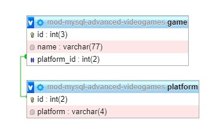
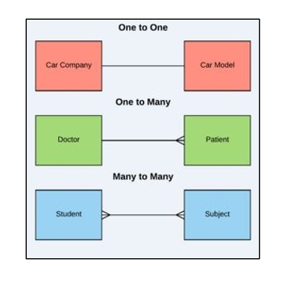

# MYSQL-ADVANCED-RELATIES-TAAK-02

## Relaties tussen database-tabellen

## Uitleg

### Relaties

Terug naar de relatie die er nu bestaat tussen de twee tabellen. Deze is schematisch in een ERD weergegeven in onderstaand plaatje.

Bovenstaand plaatje in een screenshot uit de PhpMyAdmin Designer view. 

De groene verbinding geeft de relatie weer tussen de twee tabellen. De verbinding loopt van de `platform.id` kolom naar de `game.platform_id` kolom.

Een relatie bestaat altijd tussen **twee** tabellen, nooit *meer* of *minder*. Er zijn 3 soorten relaties, in dit geval gaat het om een `One to Many` relatie. Als je dit moet verwoorden dan zou je kunnen zeggen dat: 

> elke game in de `game` tabel één platform heeft en dat elk platform in de `platform` tabel meerdere games heeft. 
 
Je kunt misschien uitzonderingen hierop bedenken, er zijn tenslotte games die op meerdere platformen zijn uitgebracht. Het zou daarom exacter zijn om te zeggen dat:

> elke rij in de `game` tabel matched met 1 (One) rij in de `platform` tabel en dat elke rij in de `platform` tabel matched met meerdere (Many) rijen in de `game` tabel. 

### Andere soorten relaties

In onderstaand plaatje zijn de 3 verschillende relaties getoond die je in een Relationeel Database Systeem kan aanbrengen. 

- One to One
  > Het model van een auto hoort bij een enkele auto fabrikant.
- One to Many
  > Eén docter heeft meerdere patienten maar 1 patient heeft maar 1 docter (hopelijk)
- Many to Many
  > Een student heeft meerdere vakken en elk vak heeft meerdere studenten die dat vak volgen.

## Leerdoelen

## Opdracht

Noteer je antwoorden op onderstaande opdrachten in `antwoorden.md`. Zie uitleg voor een voorbeeld.

1. Bedenk drie voorbeelden uit het echte leven waartussen een **One to One** relatie bestaat
2. Bedenk drie voorbeelden uit het echte leven waartussen een **One to Many** relatie bestaat
3. Bedenk drie voorbeelden uit het echte leven waartussen een **Many to Many** relatie bestaat

## Bronnen

