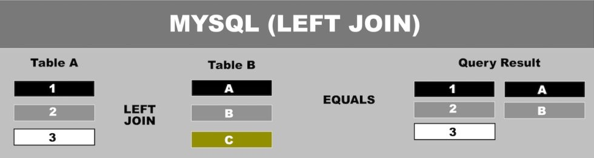
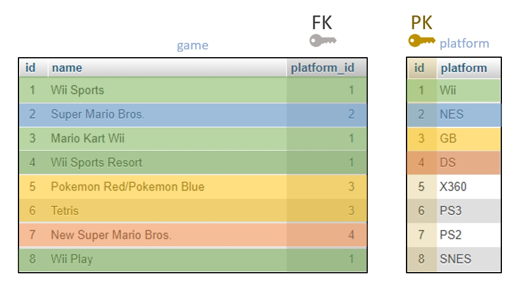
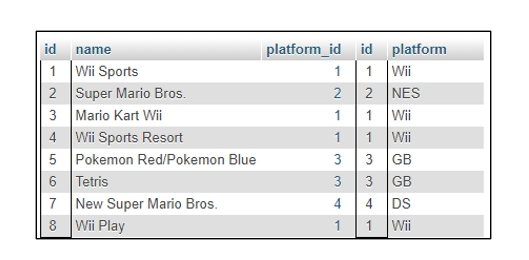

# MYSQL-ADVANCED-RELATIES-TAAK-05

## Uitleg

Tot nu toe hebben we gezien hoe je een database kan ontwerpen zodat je dubbele data vermijd en heb je handmatig gegevens bij elkaar gezocht door de inhoud van Primary Key en Foreign Key kolommen met elkaar te vergelijken.

Uiteraard kan dit gemakkelijker. MySQL geeft je de mogelijkheid om gegevens uit meerdere tabellen samen te voegen door een enkele query uit te voeren. Dit doe je door aan een SELECT query een JOIN clausule toe te voegen.

Er zijn 4 verschillende soorten JOINS. We beginnen met de zogenaamde LEFT JOIN. Hierbij gaan we uit van een tabel en zoeken we overeenkomstige gegevens erbij uit een andere tabel op basis van twee kolommen.

### Join Syntax

De syntax van een JOIN clausule ziet er zo uit:

```SQL
SELECT * FROM <table1> JOIN <table2> ON <table1.kolom> = <table2.kolom>;
```
Wat je hiermee eigenlijk zegt in je query is:
> Geef me alles (`SELECT *`) van tabel1 (`FROM <table1>`) en voeg dit samen met tabel2 (`JOIN <table2>`) op basis van (`ON`) de Foreign Key kolom in tabel1 (`<table1.kolom>`) en de Primary Key kolom van tabel2 (`<table2.kolom`>).

### Joins schematisch uitgelegd

Schematisch zou het er dan zo uit zien zoals in onderstaand plaatje. Je ziet in het resultaat dat er voor de 3de rij in Table A geen overeenkomstige rij is gevonden in Table B. Zo werkt het met een LEFT JOIN; je krijgt alles terug uit Table A en als er niks wordt gevonden in Table B dan blijft dit veld leeg.



### Voorbeeld tabellen

Als we terug gaan naar onze voorbeeld database dan zie in onderstaand plaatje met kleuren aangegeven welke rijen op basis van de` game.platform_id` **Foreign Key** kolom en de `platform.id` **Primary Key** kolom met elkaar overeenkomen.



Om een JOIN uit te voeren op deze database zouden we dan de volgende SQL query schrijven:
```sql
SELECT * FROM game JOIN platform ON platform.id = game.platform_id;
```

Het resultaat wat je dan te zien krijgt staat hieronder: (letwel, dit is het resultaat van de voorbeeld gegevens, in werkelijkheid is bestaat de game tabel uit bijna 1000 rijen en niet alleen de 8 rijen uit het voorbeeld.)



### Where clausule toevoegen

Om in de echte database te werken en bijvoorbeeld alleen van de eerste 8 spellen in de game tabel een overzicht te krijgen moet je een WHERE clausule toevoegen aan je SQL query"

```sql
SELECT * FROM game JOIN platform ON platform.id = game.platform_id WHERE game.id < 9;
```
Je plakt deze er gewoon achteraan. Nog één voorbeeld. Stel we willen alleen de naam en het platform terugkrijgen van het spel "Tetris" (Tetris is een heel bekend spel en is wel zeker op meerdere platformen uitgekomen). De SQL query die we dan zouden schrijven ziet er als volgt uit:

```sql
SELECT game.name, platform.platform FROM game JOIN platform ON platform.id = game.platform_id WHERE game.name = "Tetris";
```
Als je deze query zou uitvoeren op de echte database dan krijg je twee rijen terug. Volgens de database zijn er twee platformen waarop Tetris is uitgekomen: De Nintendo Nes en de Nintendo Gameboy.

> LETOP: Het is handig om verwarring te voorkomen dat je kolommen benoemt met de volledige naam gescheiden door een punt (`.`). Je vraagt dus om `tabel.kolom` in je SELECT statement. In dit geval dus `game.name` bijvoorbeeld. 

## Leerdoelen

1. Ik weet wat een JOIN clausule is en hoe ik deze kan toepassing in een SQL query. 
2. Ik weet hoe ik specieke kolommen kan op vragen in een SELECT statement
3. Ik weet hoe ik een WHERE clausule toevoeg aan een SELECT statement met een JOIN clausule

## Voorbereiding

Gebruik de `mod-mysql-advanced-videogames` database uit **taak02**. (Als je die nog niet hebt aangemaakt doe dit dan alsnog door de database export te importeren in een nieuw aangemaakte database genaamd `mod-mysql-advanced-videogames`.)

Voer de onderstaande opdrachten uit door een SQL query te schrijven met een JOIN en eventueel een WHERE clausule als nodig. Maak voor elke geschreven query een bookmark aan in PhpMyAdmin met een logische naam, b.v. `3-relaties/taak05/opdracht1` voor de eerste opdracht, etc.

## Opdracht

1. Maak een overzicht van alle spellen met het platform  waarop ze zijn uitgekomen.
2. Maak een overzicht van de eerste 10 spellen in de game tabel (gebruik het id veld in de game tabel)
3. Maak een overzicht dat alleen de **naam** en het **platform** laat zien van de game "Call of Duty: Advanced Warfare".
4. Maak een overzicht dat het platform en de naam (in die volgorde) toont van alle games die beginnen met "FIFA". (gebruik de LIKE operator, zie [bronnen](#bronnen))
5. Maak een overzicht van de naam en het platform van het spel "Borderlands" én het spel "Borderlands 2". (gebruik je dan een AND of een OR?)


## Bronnen
[W3Schools - SQL LIKE Operator](https://www.w3schools.com/SQL/sql_like.asp)