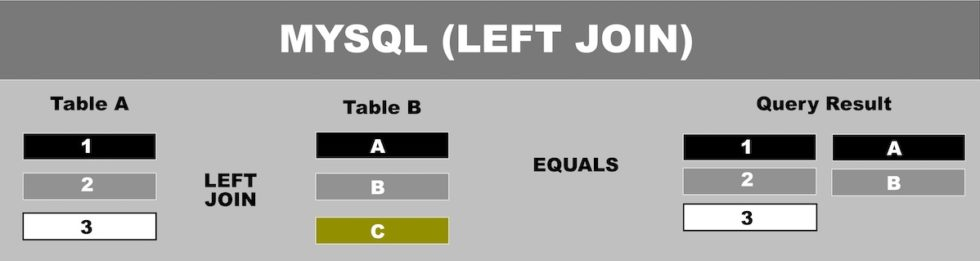
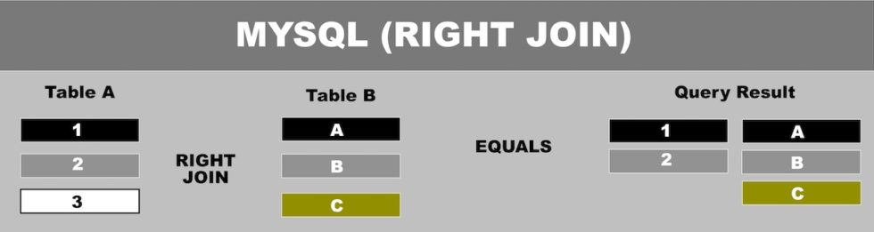
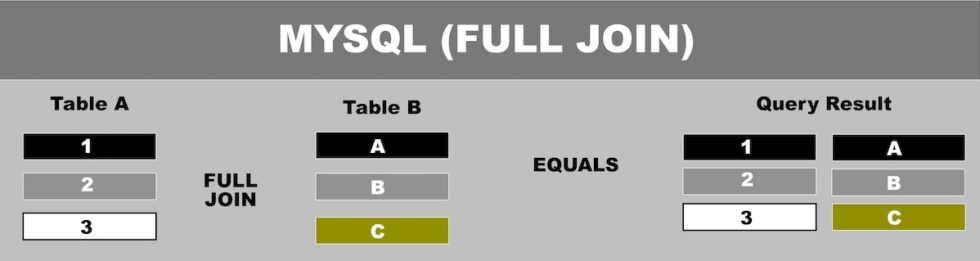
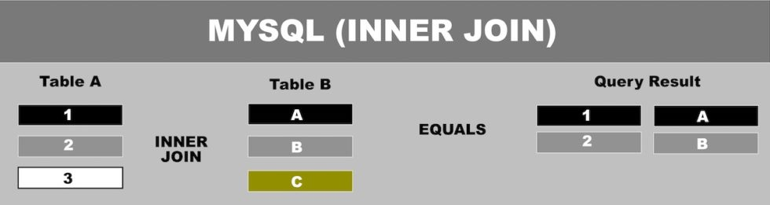
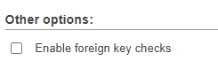

# MYSQL-ADVANCED-RELATIES-TAAK-06

## Uitleg

Vorige taak hebben we gezien hoe we gegevens uit twee tabellen kunnen ophalen door een JOIN clausule toe te voegen aan een SELECT statement. We gebruikten hiervoor een LEFT JOIN. Er zijn nog 3 andere type JOINS, deze staan hieronder beschreven.

De vier JOINS zijn:

### LEFT JOIN

> De join gaat uit van de linker tabel (TableA in het voorbeeld) en zoekt gegevens erbij in de rechter tabel (TableB in het voorbeeld). Als er geen overeenkomstige rij gevonden wordt in de rechter tabel dan blijft de waarde leeg.

### RIGHT JOIN

> Dit type JOIN gaat uit van de rechter tabel en zoekt gegevens erbij van de linker tabel. Als er geen overeenkomstige rij gevonden wordt in de linker tabel dan blijft de waarde leeg.

### FULL JOIN

> Dit type JOIN geeft alle rijen terug die bestaan in de linker en rechter tabellen ook als er geen match is voor een rij in de andere tabel. MariaDB, de database die je in je XAMPP installatie hebt draaien ondersteund standaard geen FULL JOIN.

### INNER JOIN

> Dit type JOIN geeft alleen de rijen terug die een match in beide tabellen. Er vallen dus geen gaten in gegevens zoals bij een LEFT en RIGHT JOIN.

We concentreren ons in deze module voornamelijk op de LEFT JOIN maar het is goed om te weten dat er andere mogelijkheden zijn. Om nog eens goed te laten zien hoe je bij een LEFT of RIGHT join ontbrekende gegevens kan zien gaan we twee opdrachten doen die dit laten zien in een aangepaste database.

## Leerdoelen

1. Ik weet dat er 4 soorten JOINS zijn en kan deze toepassen in een SQL statement.
2. Ik heb kan een LEFT en RIGHT JOIN uitvoeren en begrijp dat je daarbij soms ontbrekende gegevens terug krijgt.

## Voorbereiding

We maken gebruik van een aangepaste database waarbij een aantal gegevens zijn verwijderd zodat je kan zien wat het resultaat is van de verschillende joins. Je vind de database in de `db-export` map. Importeer deze in een nieuwe database genaamd `mod-mysql-advanced-videogames-joins` en maak de onderstaande opdrachten. 
> LETOP: zet tijdens het importeren van de database het vinkje uit bij `Enable foreign key checks`. Dit moet omdat er express gegevens zijn verwijderd uit deze database waardoor de check of de foreign keys wel kloppen een foutmelding geeft en de import wordt gestopt. Zie plaatje hieronder als voorbeeld:
> 
> 

## Opdracht

1. Maak een overzicht van de naam en het platform dat erbij hoort voor alle spellen die beginnen met "Grand Theft Auto". Gebruik een LEFT JOIN en de LIKE operator.
   > Als je de opdracht goed hebt uitgevoerd staan er twee rijen in met de waarde *NULL* in de platform kolom.
2. Maak een overzicht van het platform "SCD" met de namen van alle spellen die daarbij te vinden zijn in de game tabel. Gebruik een RIGHT JOIN.
   > Als het goed is zie je dat er geen spellen te vinden zijn voor het "SCD" platform dus krijg je weer een *NULL* terug maar nu in de `game.name` kolom.

## Bronnen
[W3Schools SQL Joins](https://www.w3schools.com/sql/sql_join.asp)  
[W3Schools - SQL LIKE Operator](https://www.w3schools.com/SQL/sql_like.asp)