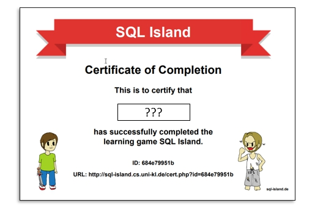

# MYSQL-ADVANCED-RELATIES-TAAK-08

## Uitleg

Je hebt in de MySQL Basic en MySQL Advanced modules geleerd hoe je de basis CRUD operaties uitvoerd op een database. 

In deze taak gaan we een spel spelen waarin het groot gedeelte van de CRUD operaties herhaald worden. 

## Leerdoelen

1. Ik kan een SQL query schrijven voor de basic CRUD operaties

## Opdracht

1. Speel SQL Island online op de [SQL Island](http://sql-island.informatik.uni-kl.de/?lang=en) website. Lees de onderstaande punten door voor je begint.
   > - Je moet in totaal 21 querries schrijven voor je het spel hebt uitgespeeld.
   > - Als je de kans krijgt een naam in de vullen voor je karakter kies dan je eigen voornaam + achternaam (dit komt terug in het certificaat dat je krijgt als je het spel hebt uitgespeeld.)
   > - Als je klaar bent download dan de PDF met het certificaat en plaats deze in de `taak08 - Herhaling` map en commit en push naar Github.

