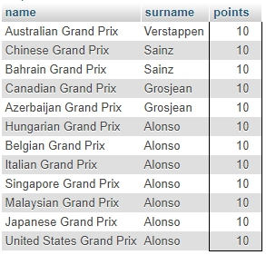
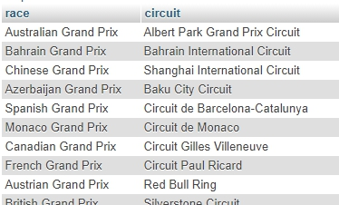
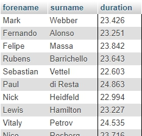
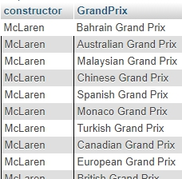
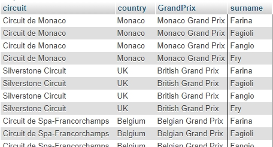

# MYSQL-ADVANCED - Eindopdracht

## Eindopdracht Mysql-Advanced

## Uitleg

Je bent sinds kort in dienst bij een startup die een website beheerd waarop je historische informatie over Formule 1 races kan opzoeken. De startup heeft een frontend gemaakt waarin bezoekers informatie kunnen filteren op verschillende soorten gegevens. Nu is er gebleken uit verzamelde user gegevens dat bepaalde filters heel vaak worden gebruikt. De wens bestaat nu uit het user interface team om een serie knoppen te maken voor de site waarmee meteen een overzicht kan worden gegenereerd met veel opgevraagde informatie.

Jij bent net in dienst als backend allrounder en krijgt de taak om de SQL querries uit te werken voor deze overzichten. De querries worden via PHP uitgevoerd en het resultaat dat je terugkrijgt van de MySQL server worden 1-op-1 getoond aan de gebruikers van de website.

## Leerdoelen

1. Ik kan een SQL query schrijven met meerdere joins

## Voorbereiding

Voor de eindopdracht van MySQL-Advanced maken we gebruik van een nieuwe database met daarin gegevens over gereden Formule 1 races van 1950 tot 2018.

De ERD ziet er als volgt uit:

Maak een nieuwe database aan in PhpMyAdmin genaamd `mod-mysql-advanced-formula1-7tables` en importeer de `formula1-7table.zip` daarin. Gebruik het tabblad `SQL` in PhpMyAdmin om SQL querries te schrijven die overzichten maken zoals die gevraagd worden in de opdracht.

> LETOP: Deze nieuwe database is je nog onbekend. De eerste stap om hiermee om te gaan is om de database te onderzoeken en te kijken welke informatie in welke tabellen staat. 

## Opdracht

Schrijf een SQL query die de onderstaande overzichten als resultaat heeft. Zie [Eindresultaat](#eindresultaat) voor screenshots van de gewenste output in 

1. Maak een overzicht waarin te zien is welke races op welke circuits worden gereden in het laatste jaar waarvoor informatie staat in de database.
   > LETOP: zorg ervoor dat je een ALIAS gebruikt in je query zodat het duidelijk is wat voor informatie in elke kolom staat.
2. Maak een overzicht waarin te zien is welke races er in 2017 gereden zijn met daarnaast de achternaam van driver die 10 punten heeft gehaald in een race. 
3. Maak een overzicht van de voornaam en achternaam van alle drivers met daarnaast alle pitstops die korter duren dan 25 seconden.
4. Maak een overzicht van McLaren (een constructeur van formule 1 autos) en de naam van de races uit 2010 waarin McLaren een auto had rijden.
5. Maak een overzicht van de naam van een circuit met daarnaast het land waarin dit circuit zich bevind en de naam van de races die in 1950 zijn gereden op dit circuit door alle drivers wiens achternaam begint met de letter F.

## Eindresultaat

Onderstaande screenshots geven weer hoe de output in PhpMyAdmin er uit moet komen te zien. 

### Opdracht 1

### Opdracht 2

### Opdracht 3

### Opdracht 4

### Opdracht 5
